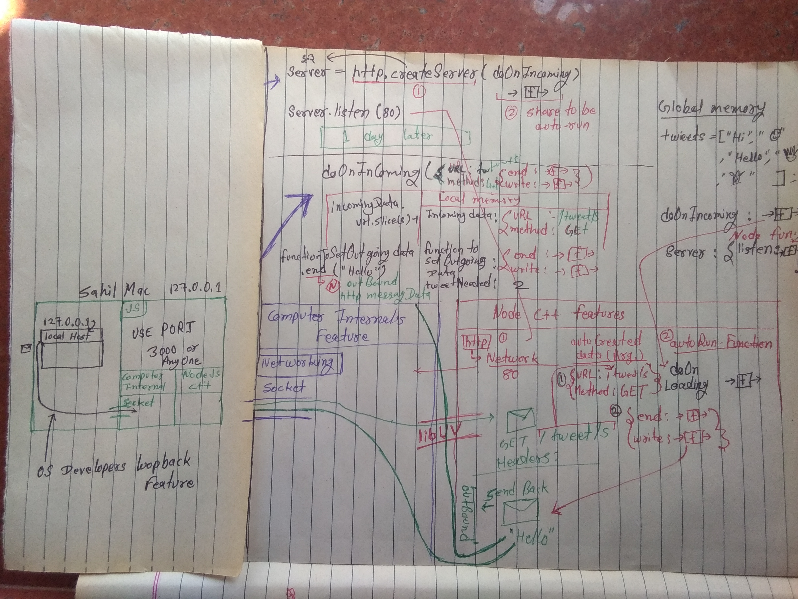
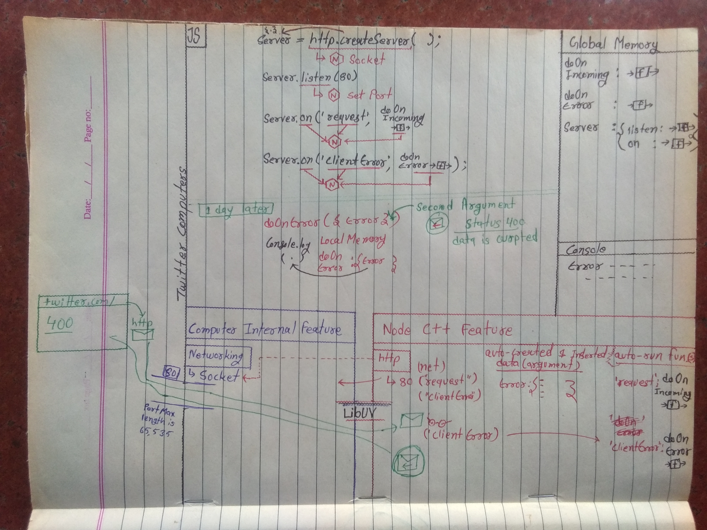
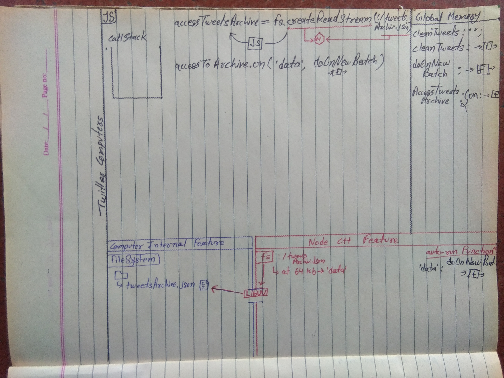

# Course--The-Hard-Parts-of-Servers-Node.js

Reference: [The-Hard-Parts-of-Servers-Node.js- Will Sentance] (https://frontendmasters.com/courses/servers-node-js/)

## Node Overview

Client requests to the server. Any kind of client can be like chrome, safari, firefox, opera and mobile. Client requires minimum 3 things to load web page.

1. HTML
2. CSS
3. JavaScript

But where do we get these things. Client search a URL. This request will be sent to the server and the server will send the response to the client after processing that request.

Some languages are used to give instruction to the server.

-   PHP
-   Ruby
-   Java
-   C/C++
-   JavaScript

Response is sent according to the data/code requested by the client. Like if the client has requested for the home page, then we have to fine send HTML, css and JavaScript, then we will access the file using the filesystem (fs) features of the server.
Socket to handle network request.

JavaScript is not able to access internal feature of server. C/C++ and JavaScript to able accessing the internal feature. this called is **node**.

-   C++ has may features that let it directly interact with the OS directly.

-   JavaScript does not! So it has to work with C+

*   to control these computer features. What is
    this combination known as? ... Node.js

-   JS -> Node -> Computer feature (e.g.
    network, file system)

### Let’s see the 2 things that JS does by itself - saving and using data

```js
let num = 3;
// 1. Save a function (code to run, parameters awaiting inputs)
function multiplyBy2(inputNumber) {
	const result = inputNumber * 2;
	return result;
}
// 2a. Call/run/invoke/execute a function (with parens)
// and 2b. insert an input (an argument)
const output = multiplyBy2(num);
const newOutput = multiplyBy2(10);
```

## Using Node APIs

```js
const server = http.createServer();
server.listen(80);
```

`http.createServer()` This code is interact with C++ through Node. This command for node internal feature.

Help of [libUV](https://github.com/libuv/libuv) (Some C ++ code is already written in libUV) open **socket**, an open channel to the internet.Setup a network feature of node but this time to not able to receive messages because port is not port is setup in next line.

Node js make Network(net) -> http

libUV like Node code to any computer internal structure like MAC, Linux or Window.

Channel max length is `65,535`. Different number to represent an entry point to channel to my computer called as PORT.

The entry point for receiving messages from the server is default port 80.

This time `http.createServer()` return a object. In the object listen property hold a method. When run listen method than allow us to edit instance http. Which libUV set up the HTTP instance. this time i am able to receive messages.

### Calling method in NodeJs

Node auto-tun the code. When a incoming message is received than call a function and send back relative data.

```js
function doOnIncoming(incomingData, functionsToSetOutgoingData) {
	functionsToSetOutgoingData.end('Welcome to Twitter!');
}
const server = http.createServer(doOnIncoming);
server.listen(80);
```

first declare `doOnIncoming` function, next line `http.createServer(doOnIncoming)` opening the socket, opening the port using the computer tunnel but one more work in this line.

In this line `http.createServer(doOnIncoming)` createServer accept a function argument. this function is auto run than receive incoming messages.

### Calling a Function Under the Hood

// ..

### Creating a Server Under the Hood

```js
function doOnIncoming(incomingData, functionsToSetOutgoingData) {
	functionsToSetOutgoingData.end('Welcome to Twitter!');
}
const server = http.createServer(doOnIncoming);
server.listen(80);
```

When request a server than the node called the doOnIncoming function automatically and Node inserts 2 arguments automatically. Both arguments will contain an object.

Create a brand new execution context and inside of the local environment persist `incomingData`. this is a object and hold the path of the url, header, body and etc. Second argument is a object `functionsToSetOutgoingData`. this object contains some properties like `end` property persist a function and etc.

When calling `functionsToSetOutgoingData.end('some message')` inside of the execution context then `.end` function intimate connect back to node, the node add the message into HTTP message and then that message is going to be send back to the client.

### Request & Response with Node

**Request**: When a request is made to the server, the client creates an HTTP message.

#### Examples of Request Message

```
GET /tweets/s HTTP/1.1
**Host**: localhost: 8000
Connection: keep-alive
Accept-Language: en-us
User-Agent: Mozilla
```

#### There are 2 ways for GET METHOD

1. Request line
    - `GET /tweets/s HTTP/1.1`
    - Method type gate is inside the HTTP message and the path.
    - Request method: All methods must be in uppercase. The request will be recognized by the given request-URI
        - **GET** request do not have a message body.
        - **POST** request can contain the post data in the body
2. Request Header : Additional information about the client is given in this field. These fields act as request modifiers. meta data, like
    - **HOST** is mandatory
    - **Accept-Language**
    - **Connection**
    - **User-Agent**

These messages will be sent to the server.

#### Example

```js
function doOnIncoming(incomingData, functionsToSetOutgoingData) {
	functionsToSetOutgoingData.end('Welcome to Twitter!');
}
const server = http.createServer(doOnIncoming);
server.listen(80);
```

##### Example explanation

-   **`http.createServer`**

    -   setup the node background feature. This function will return an instance object to us containing a method named listen And will contain more properties.
    -   `http` background feature is Network (net) and this feature is setup the socket through the [libUV](https://github.com/libuv/libuv).
    -   `createServer` is a method of `http`. This function will be auto called by node JS and Auto created two argument by node js.
        -   `incomingData`, parameter value type is object. This parameter value is passed by node js and In the request message, the path of the request-line will be saved in the property named URL.
        -   `functionsToSetOutgoingData`, parameter value type is object. This parameter value is passed by node js and end property hold a function. More properties will be available in the object
            -   `functionsToSetOutgoingData.end('Welcome to Twitter!');`, This method is sent back a request to the client.
    -   `doOnIncoming`, This function is automatic called by node js.
        -   when will be called this function?
            -   When a request is made by a client, this function will be auto called by NodeJs.

-   **`server.listen(80)`**

    -   setup the computer internal feature and open channel to the internet with port.

    -   Set the port `server.listen(80)`. The browser default entering port is 80. Port 80 means request for data.

## Node with HTTP

### Preparing for HTTPRequestObject

Messages are sent in HTTP format

HTTP message: Request line (url, method),
Headers, Body (optional)

```js
const tweets = ['Hi', '😂', 'Hello', '👋', '👻'];
function doOnIncoming(incomingData, functionsToSetOutgoingData) {
	const tweetNeeded = incomingData.url.slice(8) - 1;
	functionsToSetOutgoingData.end(tweets[tweetNeeded]);
}
const server = http.createServer(doOnIncoming);
server.listen(80);
```


### Parsing HTTPRequestObject

HttpRequest Node JS internal features to get a request from libUV after node js features get HttpRequestMessage, auto-creates two arguments. which will object the first object which will have "URL" and "method" name property and the second object I will have the property named "end" and both properties contain methods.


### HTTP Response in Node


### Response Headers

Our return message is also in HTTP format

-   We can use the body to send the data and
    headers to send important metadata

-   In the headers we can include info on the
    format of the data being sent back - e.g. it’s
    html so to load it as a webpage

### Intro to Require in Node

```js
const http = require(‘http’);
```

Return a object

```
{
    createServer: ->f->
}
```

http is not a part of javascript. This is label for Node C++ feature.

### JavaScript Node Development

1. Write the code (VSCode et al)
2. Load server file in terminal
    ```
    $ node server.js
    ```
3. Need to reload our code with Node every time we make a change so nodemon.
    ```
    $ nodemon server.js
    ```

### Cloud Node Development

we have somebody else computer be always on or connect through the internet. Some company is provided always on computer. like: [AWS](https://aws.amazon.com/) (Amazon), [Google](https://cloud.google.com/) and [Microsoft](https://azure.microsoft.com/en-gb/).

Do we need an always-on computer in our
house to run a server?

1.  Write code on your computer
2.  SSH into someone else’s computer (one of
    AWS’s) - I'm gonna use my terminal to control AWS's. A computer on the internet owned by AWS's and we going to do something called SSH, which is a way of securely patching in interfacing with AWS's computer through SSH.

        - now, turn on node on Amazon's computer And load up my server JS code to run, not on my computer, but on Amazon computer.

3.  Set up DNS to match domain name to right IP

    -   With the help of DNS (Domain Name Server) when search twitter.com. It's a ledger, ledger just means a comparison of two things side by side Of all domain names.

    -   **how it handle this situation.**
        Amazon it's not just one computer, you're dealing with a million possible computers. Specifically how you match up exactly.How it enters a Amazon server, Will stay here but we make all of the configurations, this is what is called DevOps.
        DevOps is the extremely interesting and challenging situation of ensuring that you've managed to get your code running on Amazon's computer with the node app running and that when "other user" go to twitter.com that Amazon entry point is configured correctly, that Amazon IP address as it's known as. That the URL is matched to is gonna enter at the exact right computer.


### Local Node Development

OS developers included the loopback feature with localhost.



## Events & Error Handling

### Event Handling in Node

HTTP instance or feature we've set up. So if I want to set up my port in the background, after I've set up the HTTP feature with createServer.

http.createServer() : setup a socket

-   what was Node's output of running createServer, what was the C++ output of running createServer?

    -   Setting up the socket.

-   what's JavaScript's output of running createServer?
    -   The object with the functions available.
    -   Which modify Node's behavior.


### Modifying the Node Server


### Node Event Handling in Action



## File System

### Importing with fs

```js
function cleanTweets(tweetsToClean) {
	// code that removes bad tweets
}
function useImportedtweets(errorData, data) {
	const cleanedTweetsJson = cleanTweets(data);
	const tweetsObj = JSON.parse(cleanedTweetsJson);
	console.log(tweetsObj.tweet2);
}
fs.readFile('./tweets.json', useImportedtweets);
```

### Reading from the File System with fs


### Call Stack Introduction


#### Error-first callbacks

When Error is appear the first argument value is null otherwise parameter value is switched in this function `useImportedtweets(errorData, data)`. fs.readFile is a asynchronous methods.

[Example](./File-System/error-first-callbacks)

```js
const fs = require('fs');

function errorFirstCallback(err, data) {
	if (err) {
		console.error('There was an error', err);
		return;
	}
	console.log(data);
}

fs.readFile('./my-data.json', errorFirstCallback); // <Buffer 7b 0a 20 20 20 20 22 >
fs.readFile('./does-exist', errorFirstCallback); // Error
```

output

```
There was an error [Error: ENOENT: no such file or directory, open './does-exist'] {
    errno: -2,
    code: 'ENOENT',
    syscall: 'open',
    path: './does-exist'
}
<Buffer 7b 0a 20 20 20 20 22 ... >
```

---

## Streams

```js
let cleanedTweets = '';
function cleanTweets(tweetsToClean) {
	// algorithm to remove bad tweets from `tweetsToClean`
}
function doOnNewBatch(data) {
	cleanedTweets += cleanTweets(data);
}
const accessTweetsArchive = fs.createReadStream('./tweetsArchive.json');
accessTweetsArchive.on('data', doOnNewBatch);
```

### Setting Up the Stream



### Processing Data in Batches


### Checking the Callback Queue
Node.js is a single threaded language which in background uses multiple threads to execute asynchronous code.

All functions that have been set to auto-run by node do not share the same callback queue.

